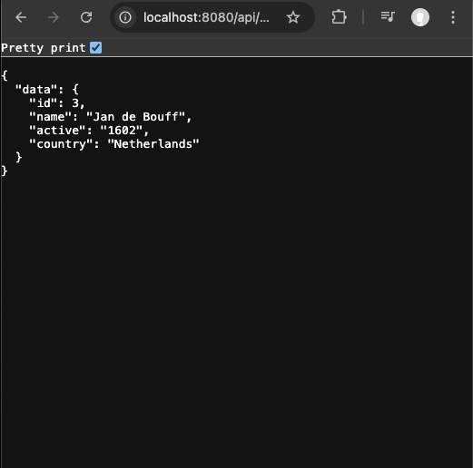

# react-to-google-cloud

## Initial Setup

First, create an initial directory for everything inside. In this example, the directory is named as `react-go-google-cloud`

```console
terminal% mkdir react-go-google-cloud
```

Go into the new directory
```console
terminal% cd react-go-google-cloud
```

## Setup a React App (Client side App)

The following steps are used to setup an initial React Application using Vite. The React App is named as `react-app`.

```console
terminal% npm create vite@latest
? Project name: > react-app
? Select a framework: React
? Select a variant: TypeScript
```

Go into the React App directory

```console
terminal% cd react-app
```

Install the dependencies

```console
terminal% npm install
```

Run the App locally (in Development mode)

```
terminal% npm run dev
```

After the above step, the local website should be available at: \
  http://localhost:5173/


## Update the React Code

Update `src/App.tsx` file to insert following code below `<button>` tag:
```html
<p>
  Ahoy, me hearties!
</p>
```

After the above step, the local website should display the changes:


## Build the React App for deployment

In the terminal where the `npm run dev` command is running, press `CTRL-C` to stop the command.

Then run following command to build the App.

```console
terminal% npm run build
```

Please note that 4 files in a `/dist` directory will be generated. Below is the example:

```console
dist/index.html                   0.46 kB │ gzip:  0.30 kB
dist/assets/react-CHdo91hT.svg    4.13 kB │ gzip:  2.05 kB
dist/assets/index-DiwrgTda.css    1.39 kB │ gzip:  0.72 kB
dist/assets/index-B4DS1gM9.js   143.24 kB │ gzip: 46.08 kB
```

## Setup an Express app (Server side App)

Go back to the parent directory

```console
terminal% cd ..
```

Generate the package.json file inside `/react-go-google-cloud` directory

```console
terminal% npm init -y
```

Install the Express package to allow receiving HTTP request from the React App.
```console
terminal% npm install express
```

Using the VSCode editor, create a new file called `index.js` inside `/react-go-google-cloud` directory. Then, insert following code inside `index.js` file.

```js
const express = require('express');
const app = express();
app.use(express.json());
app.use(express.static('react-app/dist')); // use the built code for React-App
const port = process.env.PORT || 8080;
app.listen(port, () => {
    console.log(`Listening on port ${port}`);
});

app.get('/api/pirates/:id', (req, res) => {
    const id = req.params.id;
    const pirate = getPirate(id);
    if (!pirate) {
        res.status(404).send({ error: `Pirate ${id} not found`})
    } else {
        res.send({ data: pirate });
    }
} );


function  getPirate(id) {
  const pirates = [
    {id: 1, name: 'Klaus Störtebeker', active: '1392-1401', country: 'Germany'},
    {id: 2, name: 'Kristoffer Trondson', active: '1535-1542', country: 'Norway'},
    {id: 3, name: 'Jan de Bouff', active: '1602', country: 'Netherlands'},
    {id: 4, name: 'Jean Bart', active: '1672-1697', country: 'France'},
    {id: 5, name: 'Tuanku Abbs', active: 'to 1844', country: 'Malay Archipelago'},
    {id: 6, name: 'Ching Shih', active: '1807-1810', country: 'China'}
  ];
  return pirates.find(p => p.id == id);
}
```

Then update `scripts` object inside `package.json` file:
```js
{
    ...
    "scripts": {
        "start": "node index.js"
    }
    ...
}
```

Run the `start` command to launch the Express App:

```console
npm run start
```

After the above step, the local website should be available at: \
  http://localhost:8080/


We can now test the API by going to following URL: \
  `http://localhost:8080/api/pirates/3`


The browser will show following API response:


or



## Deploy the App to Google Cloud

### Setup the project in the Google Cloud console

First, go to the google cloud server: \
  `https://console.cloud.google.com/`

Click the highlighted part to create a new project:


Enter the project name:


At the project settings page, select the billing.


If this is a first project, you will need to setup the billing


### Download the Google Cloud CLI

Run google search in the browser to obtain the instruction to install the gcloud CLI


### gcloud authentication

After done with setting up the GCLOUD CLI, go back to the project directory (`react-to-google-cloud`), to run gcloud CLI

```console
terminal% gcloud auth login
```

Then login or select the Google Account to enable the CLI to access your Google Cloud projects.

### setup current project for gcloud

From the Google Cloud, get the project ID, then run following command (replace `<PROJECT_ID>` with your project ID):

```console
terminal% gcloud config set project <PROJECT_ID>
```

In this case, if the project ID is  `react-pirate-app`, the command will be:

```console
terminal% gcloud config set project react-pirate-app
```

### gloud command to deploy

Then run following command to deploy the service (replace `<service-name>` with the actual name; replace `<source-directory> with the source location`). The same project could run multiple different services.

```console
terminal% gcloud run deploy <service-name> --source <source-directory>
```

or

```console
terminal% gcloud run deploy <service-name> --source <source-directory>
```

Example:

```console
terminal% gcloud run deploy pirate-service --source .
```

If certain APIs are not enabled on the project, the following question will be asked:

```console
The following APIs are not enabled on project 
[react-pirate-app]:
        artifactregistry.googleapis.com
        cloudbuild.googleapis.com
        run.googleapis.com

Do you want enable these APIs to continue (this will take a few minutes)? (Y/n)?
```

Just press `Y` to continue.

Then wait for awhile when following text is shown

```console
Enabling APIs on project [react-pirate-app]...
```

When asked to `Please specify a region:`, just select a location that is closest to you and enter the corresponding number.

```console
Please enter numeric choice or text value (must exactly match list item): 11
```

When asked about the Artifact Registry on the project, just answer `Y` so that you can roll back to the previous deployment.

```console
Deploying from source requires an Artifact Registry Docker repository to store built containers. A repository named [cloud-run-source-deploy] in region [australia-southeast1] will be created.

Do you want to continue (Y/n)? 
```

The following quest is asking do you allow anonymous access to the service. Press `y` because the app need to allow anonymous access.

```console
Allow unauthenticated invocations to [pirate-service] (y/N)?  
```

When the build is running, you will see something like this:
```console
Building using Buildpacks and deploying container to Cloud Run service [pirate-service] in project [react-pirate-app] region [australia-southeast1]
```

>Note: If for whatever reason, you run into issue the build has error due to missing something, please create a new project to try the above steps again.

After finish building, you will see something like this:
```console                                         
Done.                                                               
Service [pirate-service] revision [pirate-service-00001-85f] has been deployed and is serving 100 percent of traffic.
Service URL: https://pirate-service-emv454msza-ts.a.run.app
```

