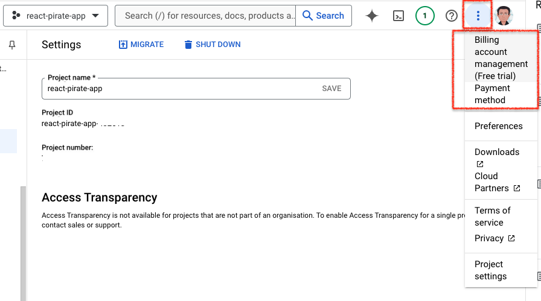

# react-to-google-cloud

This is a small project to deploy a React app to the Cloud Run service on Google Cloud. (reference: https://www.youtube.com/watch?v=NMnKGHgw8aM)

## Initial Setup

First, create an initial directory for everything. In this example, the directory is named `react-go-google-cloud`.

```console
terminal% mkdir react-go-google-cloud
```

Go into the new directory.
```console
terminal% cd react-go-google-cloud
```

## Set Up a React App (Client-side App)

The following steps are used to set up an initial React application using Vite. The React app is named `react-app`.

```console
terminal% npm create vite@latest
? Project name: > react-app
? Select a framework: React
? Select a variant: TypeScript
```

Go into the React app directory.

```console
terminal% cd react-app
```

Install the dependencies.

```console
terminal% npm install
```

Run the app locally (in development mode).

```console
terminal% npm run dev
```

After completing the above steps, the local website should be available at: \
  `http://localhost:5173/`


## Update the React Code

Update the `src/App.tsx` file by inserting the following code below the `<button>` tag:
```html
<p>
  Ahoy, me hearties!
</p>
```

  \
After completing the above step, the local website should display the changes.


## Build the React App for Deployment

In the terminal where the `npm run dev` command is running, press `CTRL-C` to stop the command.

Then, run the following command to build the app.

```console
terminal% npm run build
```

Please note that four files will be generated in a `/dist` directory. Below is an example:

```console
dist/index.html                   0.46 kB │ gzip:  0.30 kB
dist/assets/react-CHdo91hT.svg    4.13 kB │ gzip:  2.05 kB
dist/assets/index-DiwrgTda.css    1.39 kB │ gzip:  0.72 kB
dist/assets/index-B4DS1gM9.js   143.24 kB │ gzip: 46.08 kB
```

## Set Up an Express App (Server-side App)

Go back to the parent directory.

```console
terminal% cd ..
```

  \
Generate the `package.json` file inside the `/react-go-google-cloud` directory.

```console
terminal% npm init -y
```

  \
Install the Express package to handle HTTP requests from the React app.
```console
terminal% npm install express
```

  \
Using the VSCode editor, create a new file called `index.js` inside the `/react-go-google-cloud` directory. Then, insert the following code into the `index.js` file.

```js
const express = require('express');
const app = express();
app.use(express.json());
app.use(express.static('react-app/dist')); // use the built code for React-App
const port = process.env.PORT || 8080;
app.listen(port, () => {
    console.log(`Listening on port ${port}`);
});

app.get('/api/pirates/:id', (req, res) => {
    const id = req.params.id;
    const pirate = getPirate(id);
    if (!pirate) {
        res.status(404).send({ error: `Pirate ${id} not found`})
    } else {
        res.send({ data: pirate });
    }
} );


function  getPirate(id) {
  const pirates = [
    {id: 1, name: 'Klaus Störtebeker', active: '1392-1401', country: 'Germany'},
    {id: 2, name: 'Kristoffer Trondson', active: '1535-1542', country: 'Norway'},
    {id: 3, name: 'Jan de Bouff', active: '1602', country: 'Netherlands'},
    {id: 4, name: 'Jean Bart', active: '1672-1697', country: 'France'},
    {id: 5, name: 'Tuanku Abbs', active: 'to 1844', country: 'Malay Archipelago'},
    {id: 6, name: 'Ching Shih', active: '1807-1810', country: 'China'}
  ];
  return pirates.find(p => p.id == id);
}
```

  \
Update the `scripts` object inside the `package.json` file.
```js
{
    ...
    "scripts": {
        "start": "node index.js"
    }
    ...
}
```

  \
Run the `start` command to launch the Express app.

```console
npm run start
```

  \
After completing the above steps, the local website should be available at: \
  `http://localhost:8080/`


  \
You can now test the API by going to the following URL: \
  `http://localhost:8080/api/pirates/3`

The browser will display the following API response:


or

")

## Deploy the App to Google Cloud

### Set Up the Project in the Google Cloud Console

First, go to the Google Cloud Console. \
  `https://console.cloud.google.com/`

 \
Click the highlighted part to create a new project.


 \
Enter the project name.


 \
On the project settings page, select billing.



 \
If this is your first project, you will need to set up billing.


### Download the Google Cloud CLI

Search for "install gcloud" in your browser to obtain the instructions for installing the gcloud CLI.


### gcloud Authentication

After setting up the GCLOUD CLI, return to the project directory (`react-to-google-cloud`) to run the gcloud CLI.

```console
terminal% gcloud auth login
```

Then, log in or select the Google Account to enable the CLI to access your Google Cloud projects.

### setup current project for gcloud

From Google Cloud, obtain the project ID, then run the following command (replace `<PROJECT_ID>` with your project ID):

```console
terminal% gcloud config set project <PROJECT_ID>
```

  \
In this case, if the project ID is `react-pirate-app`, the command will be:

```console
terminal% gcloud config set project react-pirate-app
```

### gcloud Command to Deploy

Then, run the following command to deploy the service (replace `<service-name>` with the actual name and `<source-directory>` with the source location). The same project can run multiple different services.

```console
terminal% gcloud run deploy <service-name> --source <source-directory>
```

or

```console
terminal% gcloud run deploy <service-name> --source <source-directory>
```

Example:

```console
terminal% gcloud run deploy pirate-service --source .
```

  \
If certain APIs are not enabled on the project, you will be prompted with the following question:

```console
The following APIs are not enabled on project 
[react-pirate-app]:
        artifactregistry.googleapis.com
        cloudbuild.googleapis.com
        run.googleapis.com

Do you want enable these APIs to continue (this will take a few minutes)? (Y/n)?
```

Just press `Y` to continue.

Then, wait for a while until the following text is shown:

```console
Enabling APIs on project [react-pirate-app]...
```

  \
When asked to `Please specify a region:`, select the location closest to you and enter the corresponding number.

```console
Please enter numeric choice or text value (must exactly match list item): 11
```

  \
When asked about the Artifact Registry in the project, answer `Y` so that you can roll back to the previous deployment.

```console
Deploying from source requires an Artifact Registry Docker repository to store built containers. A repository named [cloud-run-source-deploy] in region [australia-southeast1] will be created.

Do you want to continue (Y/n)? 
```

  \
The following question asks whether you allow anonymous access to the service. Press `y` because the app needs to allow anonymous access.

```console
Allow unauthenticated invocations to [pirate-service] (y/N)?  
```

While the build is running, you will see something like this:
```console
Building using Buildpacks and deploying container to Cloud Run service [pirate-service] in project [react-pirate-app] region [australia-southeast1]
```

>Note: If, for any reason, you encounter an issue where the build has an error due to something missing, please create a new project and try the steps again.

  \
After finishing the build, you will see something like this:
```console                                         
Done.                                                               
Service [pirate-service] revision [pirate-service-00001-85f] has been deployed and is serving 100 percent of traffic.
Service URL: https://pirate-service-emv454msza-ts.a.run.app
```

When you open the website at `https://pirate-service-emv454msza-ts.a.run.app`, you should see that the app has been successfully deployed.


### New Deployment Following Source Update

You may want to redo the deployment after updating the source code.

First, you can check the existing deployment using the following command:

```console
terminal% gcloud run services list
```

  \
To redeploy after updating the source, run the following command (similar to the first time deploying):

```console
gcloud run deploy pirate-service --source .
```

> Note: To find out where the app is deployed, please go to the "Dashboard" on the Google Cloud Console website and search for "Cloud Run". From the "Services" section, select and open a service from the list. On the details page, you will find the "URL" of the app.

